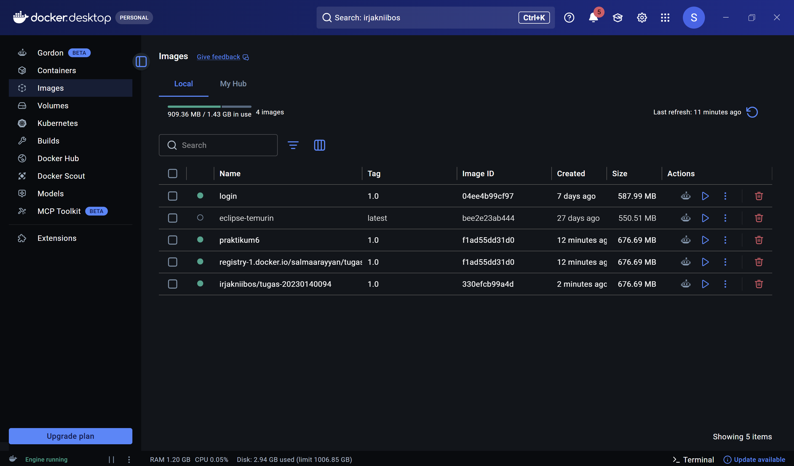
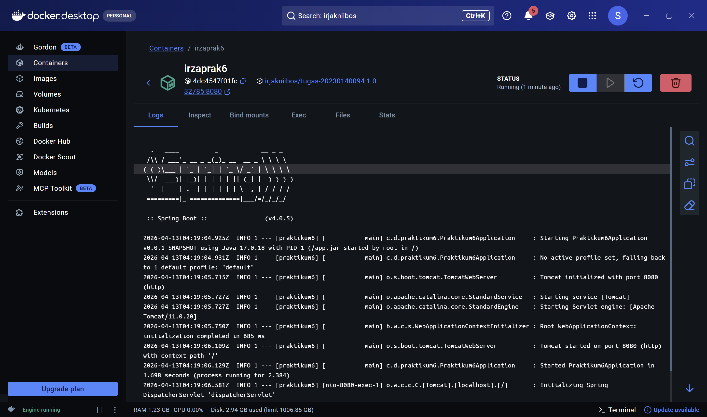
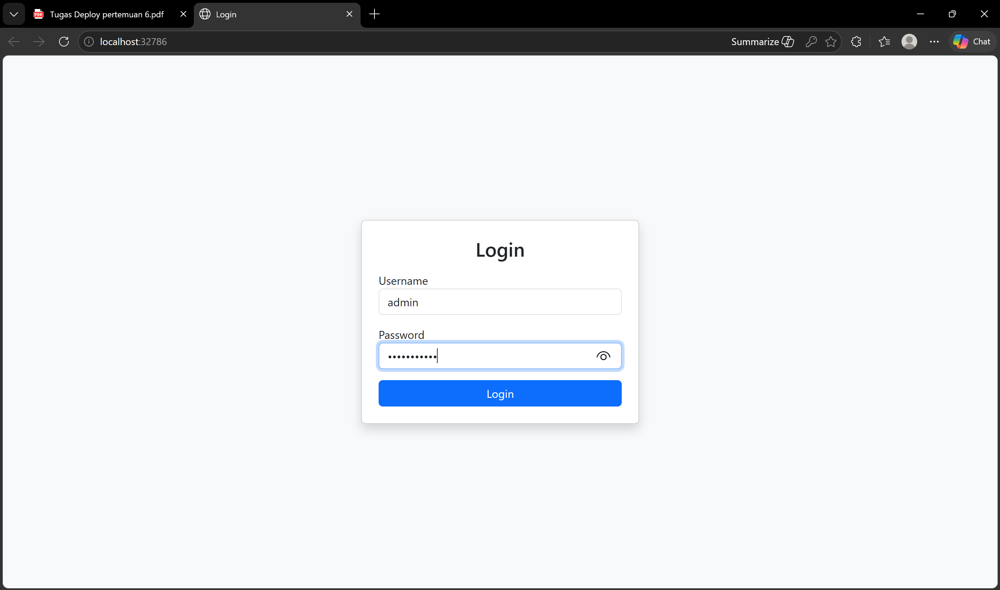
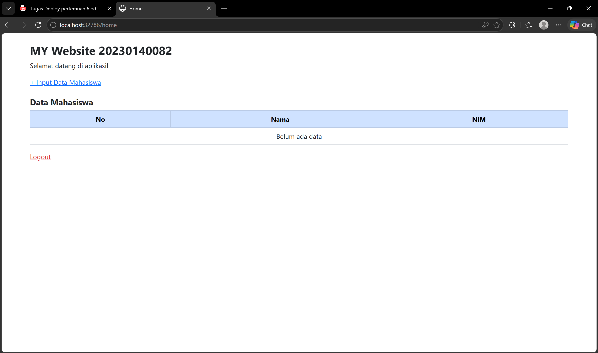
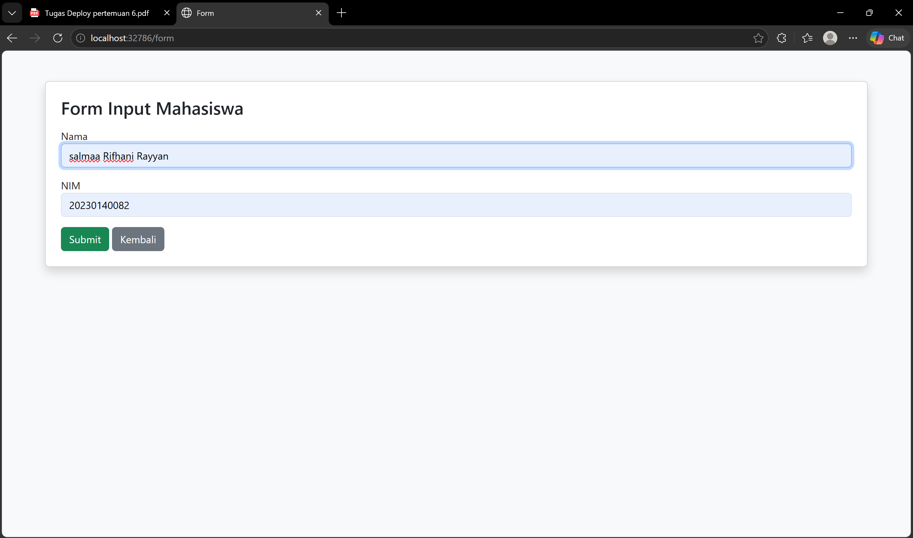
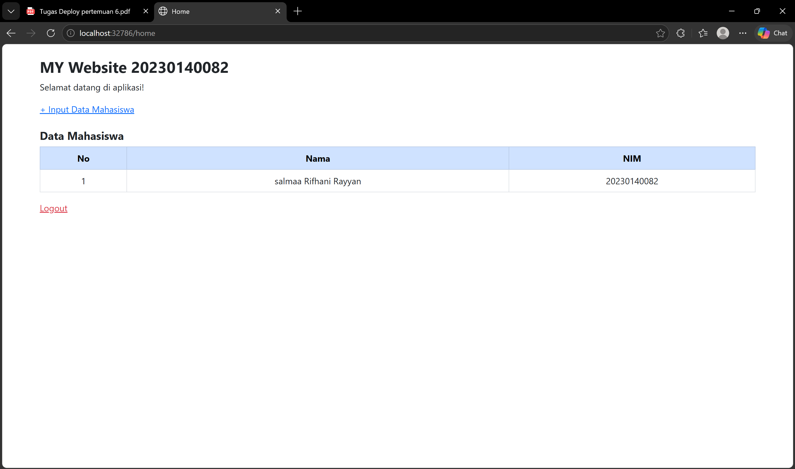
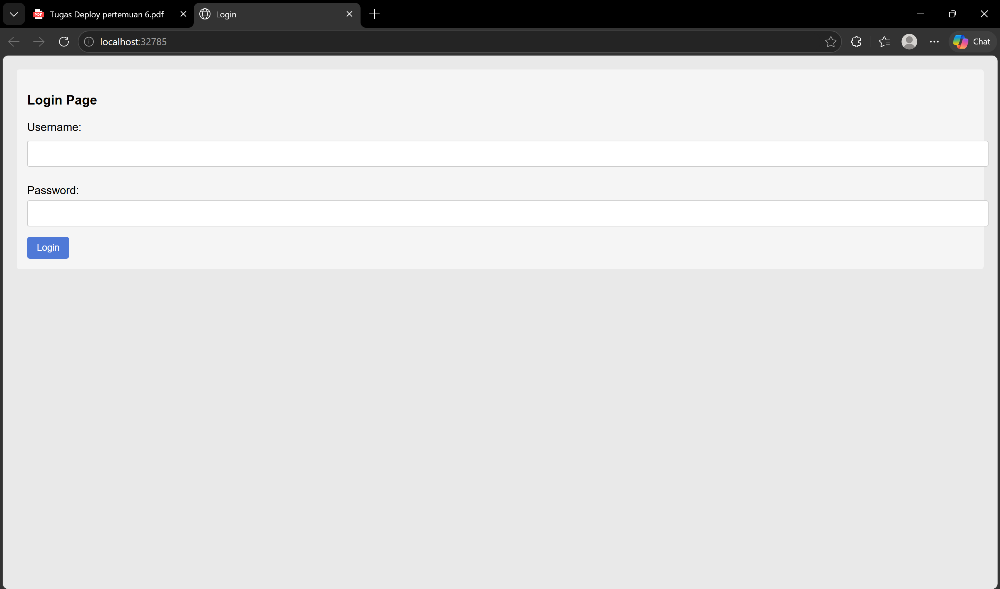
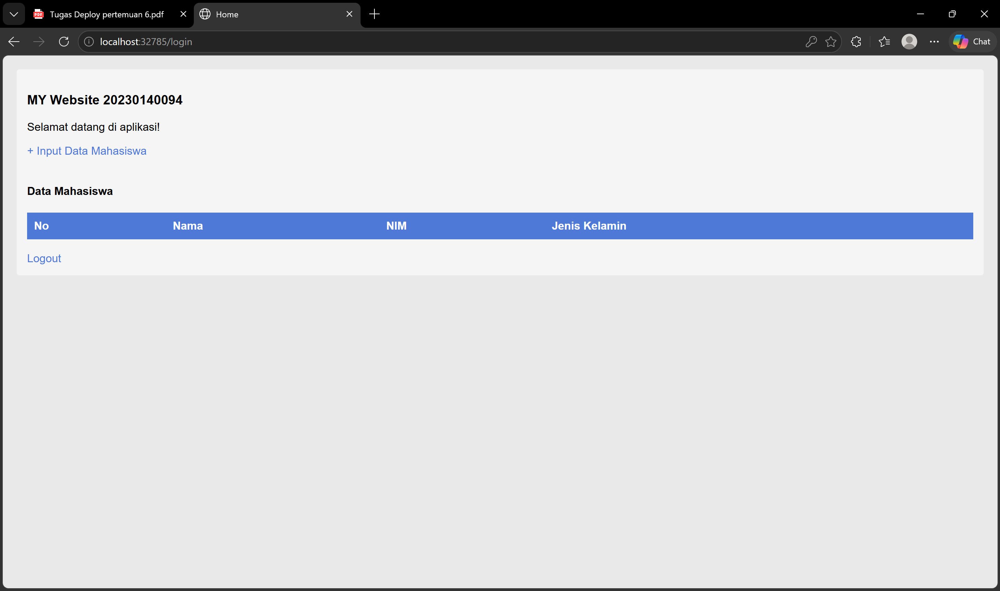
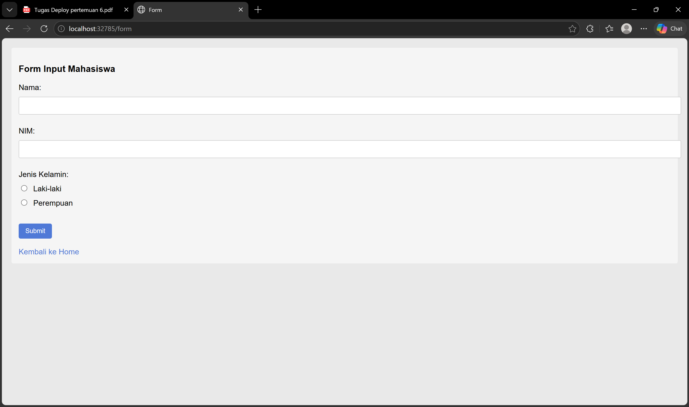
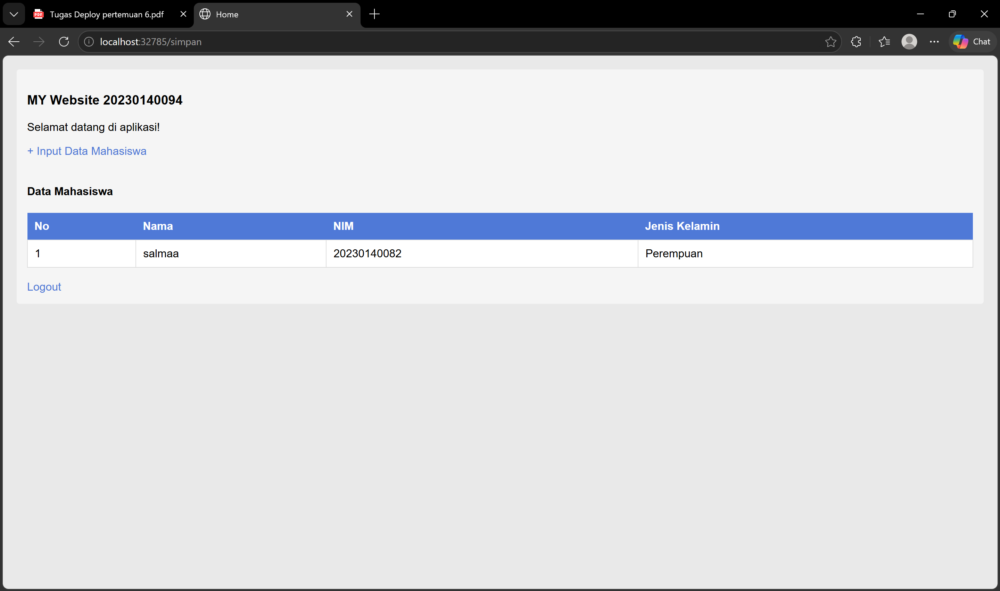

# Dokumentasi Tugas Deploy Pertemuan 6

## Identitas

* Nama: Salmaa Rifhani Rayyan
* NIM: 20230140082

---

# 1. Docker Image

Screenshot halaman **Images di Docker Desktop** setelah:

* build image sendiri
* pull image dari teman

---

# 2. Docker Container

Screenshot halaman **Containers di Docker Desktop** setelah menjalankan container dari image teman

---

# 3. Aplikasi Sendiri

## Login

---

## Home

---

## Form Input

---

## Home Setelah Input

---

# 4. Aplikasi Teman

## Login

---

## Home

---

## Form Input

---

## Home Setelah Input

---
